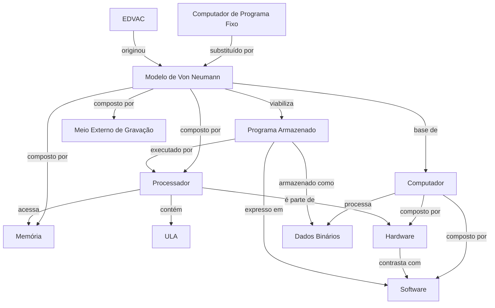

# Índice — Estudos de Computação

> [!abstract] Sobre este vault
> Notas extraídas e estruturadas a partir de textos de TI, com relações semânticas explícitas (SPO) e links bidirecionais entre conceitos.

---

## Fundamentos

Conceitos base sobre o que é um computador e como ele opera internamente.

| Nota | Definição resumida |
|---|---|
| [[Computador]] | Máquina que recebe, processa e armazena dados — tudo reduzido ao ciclo Entrada → Processamento → Saída |
| [[Hardware]] | Parte física do computador: circuitos, placas e componentes eletrônicos |
| [[Software]] | Parte lógica: sequência de instruções e dados que dirigem o hardware |
| [[Dados Binários]] | Toda informação representada internamente como sequências de 0s e 1s |
| [[Processador]] | O "cérebro" do computador; contém ULA e Central de Controle (CC) |
| [[ULA]] | Unidade Lógica e Aritmética — executa cálculos; equivale à Central de Aritmética (CA) de Von Neumann |
| [[Memória]] | RAM/ROM — volátil; armazena programas e dados em execução |
| [[Memória de Massa]] | HD, SSD, pen drive — armazenamento persistente; bloco R de Von Neumann |
| [[Meio Externo de Gravação]] | Tudo fora do processador: armazenamento, dispositivos de entrada e saída |
| [[Placa-mãe]] | Apoio físico e conexão elétrica entre todos os componentes do PC |
| [[Chipset]] | Conjunto de chips da placa-mãe; gerencia comunicação processador ↔ dispositivos (CC parcial) |
| [[Notebook]] | Variante portátil do PC — mesma arquitetura, componentes soldados e de menor consumo |
| [[Transmissão de Dados]] | Meio, canal (banda base/larga), modos (simplex/half/full-duplex), barramento vs. ponto a ponto, clock (síncrono/assíncrono) |

---

## Arquitetura & Histórico

A origem e o modelo conceitual que define os computadores modernos.

| Nota | Definição resumida |
|---|---|
| [[Modelo de Von Neumann]] | Arquitetura de 1945 com CA, CC, Memória, E/S e Gravação — base dos computadores modernos |
| [[Programa Armazenado]] | Conceito central do modelo: o programa reside na memória e pode ser trocado sem alterar o hardware |
| [[EDVAC]] | Projeto de 1945 que motivou a formalização da arquitetura de Von Neumann |
| [[Computador de Programa Fixo]] | Modelo anterior a Von Neumann: reprogramar = mover cabos fisicamente |
| [[DMA]] | Direct Memory Access — transferência direta entre armazenamento e memória sem ocupar o processador |
| [[Arquitetura Aberta e Fechada]] | Open vs. closed — fator decisivo para o sucesso do PC |
| [[PC]] | Padrão de computador pessoal criado pela IBM (1981); ~90% do mercado; mapeamento completo Von Neumann → componentes reais |
| [[Linguagem de Máquina]] | L0 — instruções primitivas executadas diretamente pelos circuitos; base de todos os níveis |
| [[Níveis de Abstração]] | Organização do computador em camadas (L0→Ln); cada nível é uma máquina virtual com sua linguagem |
| [[Tradução e Interpretação]] | Dois métodos para executar linguagens de alto nível sobre L0 |
| [[ISA]] | Instruction Set Architecture — nível 2; o que os manuais de "linguagem de máquina" descrevem |
| [[Microprogramação]] | Wilkes 1951 — interpretador embutido que simplificou hardware; dominante em 1970; eliminado pelo RISC |
| [[História da Computação]] | Tabela de marcos 1642–2001 + gerações zero, primeira, segunda e terceira |
| [[Barramento]] | Bus/omnibus — fios paralelos conectando componentes; introduzido pelo PDP-8; substituiu arquitetura centrada na memória |
| [[RISC e CISC]] | CISC: ISA complexa microprogramada; RISC: ISA simples em hardware direto; superescalar |
| [[Lei de Moore]] | Transistores dobram a cada 18 meses; círculo virtuoso; limites físicos |
| [[Tipos de Computadores]] | Taxonomia: descartável → microcontrolador → móvel → PC → servidor → mainframe; RFID; specs de consoles |
| [[Microcontrolador]] | Computador embutido: custo mínimo, tempo real, ROM; Arduino; 200+ por avião |
| [[Computação em Nuvem]] | "Mainframe 2.0"; clusters + data centers; pêndulo centralização↔descentralização |
| [[Sistema Operacional]] | Nível 3 híbrido; origem histórica dos cartões de controle (~1960); batch → timesharing |
| [[Chamada do Sistema]] | Instrução do nível SO que não existe na ISA; evolução dos cartões de controle |
| [[Linguagem Assembly]] | Nível 4 — forma simbólica da ISA; traduzida por assembler |
| [[Registrador]] | Memória interna do processador (nível 1); 16/32/64 bits; conectado à ULA no caminho de dados |

---

## Mapa de Relações

---

## Tags disponíveis

- `#computação/fundamentos` — conceitos básicos de hardware e software
- `#computação/arquitetura` — modelos e estruturas de computadores
- `#computação/histórico` — contexto histórico e projetos seminais
